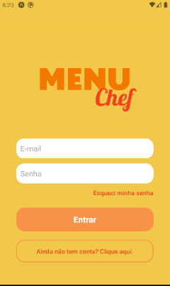
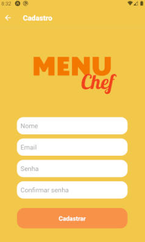
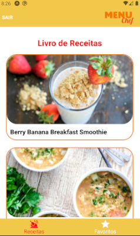
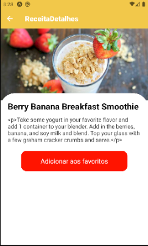
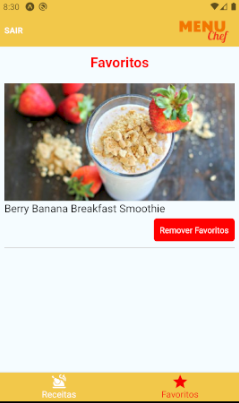
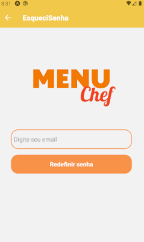

<h1 align="center"> - Menu Chef - </h1>

Nosso trabalho final em caracter de estudo e aprimoramentos da máteria de React Native, elaboramos um exemplo de uma App com o tema Receitas Culinárias.
 

  <a href="#-tecnologias">Tecnologias</a>&nbsp;&nbsp;&nbsp;|&nbsp;&nbsp;&nbsp;
  <a href="#-projeto">Projeto</a>&nbsp;&nbsp;&nbsp;|&nbsp;&nbsp;&nbsp;
  <a href="#-layout">Layout</a>&nbsp;&nbsp;&nbsp;|&nbsp;&nbsp;&nbsp;
  <a href="#memo-licença">Licença</a>

  

  
  
  
  
  
  
  
  

 

## 📱 Tecnologias

Esse projeto foi desenvolvido com as seguintes tecnologias:

- React Native
- Git e Github
- Firebase
- AsynStorage

## 💻 Projeto

O Menu Chef é um Aplicativo de Receitas em que você adiciona as melhores receitas em uma screen de Favoritos.

## 🔖 Layout

Você pode visualizar o layout do projeto através [DESSE LINK](https://github.com/jeffersonmoraesjunior).

## :memo: Licença

Esse projeto está sob a licença MIT.

---

Feito com ♥ by Grupo 2: Adriane Muniz, Hiago Carvalho, Jefferson Moraes, Jhullian Turque, Maria Eduarda Baptista!